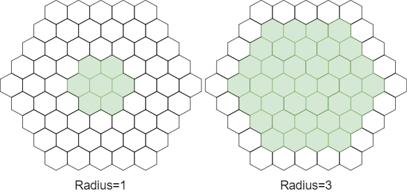
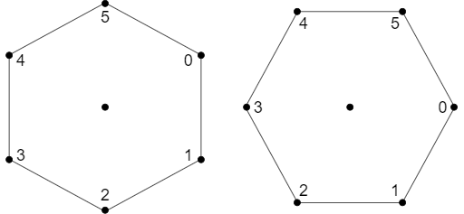

# HexagonalLib implementation for .NET
 
_I was highly inspired by this article: [https://www.redblobgames.com/grids/hexagons/](https://www.redblobgames.com/grids/hexagons/) and this repo is mostly just C# implementation of it. Recommended for reading. Here I will describe some technical details regarding implementation._
 
## Hexagonal grid
 
To use hexagonal grids you need to create [HexagonalGrid](src/HexagonalLib/HexagonalGrid.cs) and initialize it with grid type and inscribed radius of hex. 
 
```C#
var grid = new HexagonalGrid(HexagonalGridType.PointyEven, 1.0f);
```
 
Grids layouts and orientations are merged to one enum [HexagonalGridType](src/HexagonalLib/HexagonalGridType.cs).
 
*   PointyOdd - Horizontal layout shoves odd rows right [odd-r]
*   PointyEven - Horizontal layout shoves even rows right [even-r]
*   FlatOdd - Vertical layout shoves odd columns down [odd-q]
*   FlatEven - Vertical layout shoves even columns down [even-q]
 
 
## Coordinates systems
 
There is three coordinates systems represented in lib:
 
*   [Offset](src/HexagonalLib/Coordinates/Offset.cs) - offset coordinates ([link](https://www.redblobgames.com/grids/hexagons/#coordinates-offset))
*   [Cubic](src/HexagonalLib/Coordinates/Cubic.cs) - cube coordinates ([link](https://www.redblobgames.com/grids/hexagons/#coordinates-cube))
*   [Axial](src/HexagonalLib/Coordinates/Axial.cs) -  axial coordinates ([link](https://www.redblobgames.com/grids/hexagons/#coordinates-axial))
 
_Note: there is no [Doubled](https://www.redblobgames.com/grids/hexagons/#coordinates-doubled) coordinates yet. I will add them in later versions._
 
 
Struct [HexagonalGrid](src/HexagonalLib/HexagonalGrid.cs) contains a bunch of methods for coordinates conversion (all details are [described](https://www.redblobgames.com/grids/hexagons/#conversions) in original article):
 
```C#
var offsetFromCubic = grid.ToOffset(cubic);
var offsetFromAxial = grid.ToOffset(axial);
 
var cubicFromOffset = grid.ToCubic(offset);
var cubicFromAxial = grid.ToCubic(axial);
 
var axialFromOffset = grid.ToAxial(offset);
var axialFromCubic = grid.ToAxial(cubic);
```

## Neighbors
 
There is the order of neighbors of hex:
 

 
You can take a neighbor of any hex by providing a coordinate of hex and required neighbor index. 
 
```C#
var oNeighbor = grid.GetNeighbor(offset, neighborIndex);
var cNeighbor = grid.GetNeighbor(cubic, neighborIndex);
var aNeighbor = grid.GetNeighbor(axial, neighborIndex);
```
_The neighbor index can be negative or greater than 5 (it will be normalized)_

Or you can take all neighbors of particular hex

```C#
var oNeighbors = grid.GetNeighbors(offset);
var cNeighbors = grid.GetNeighbors(cubic);
var aNeighbors = grid.GetNeighbors(axial);
```
 
There is also option to check are two hexes neighbors or not:
 
```C#
var isNeighbors1 = grid.IsNeighbors(offset, oNeighbor);
var isNeighbors2 = grid.IsNeighbors(cubic, cNeighbor);
var isNeighbors3 = grid.IsNeighbors(axial, aNeighbor);
```

### Ring of neighbors
You also can get ring of neighbor for particular hex


```C#
var oNeighbors = grid.GetNeighborsRing(offset, radius);
var cNeighbors = grid.GetNeighborsRing(cubic, radius);
var aNeighbors = grid.GetNeighborsRing(axial, radius);
```

### Circle of neighbors
Same as ring but you will receive hexes from all rings



```C#
var oNeighbors = grid.GetNeighborsAround(offset, radius);
var cNeighbors = grid.GetNeighborsAround(cubic, radius);
var aNeighbors = grid.GetNeighborsAround(axial, radius);
```

## 2D space 

There is also list of methods to convert hex coordinate to its center (point represented as tuple):
 
```C#
var pointFromOffset = grid.ToPoint2(offset);
var pointFromCubic = grid.ToPoint2(cubic);
var pointFromAxial = grid.ToPoint2(axial);
```
 
To convert point into a hex coordinate which contains this point you can use:
 
```C#
var offsetFromPoint = grid.ToOffset(x, y);
var cubicFromPoint = grid.ToCubic(x, y);
var axialFromPoint = grid.ToAxial(x, y);
```
 
Hexagons have 6 sides and 6 corners. There is corners order of the hexes:



To take them in code simly use:

```C#
var cornerFromOffset = grid.GetCorner(offset, cornerIndex);
var cornerFromCubic = grid.GetCorner(cubic, cornerIndex);
var cornerFromAxial = grid.GetCorner(axial, cornerIndex);
```
_The corner index can be negative or greater than 5 (it will be normalized)_